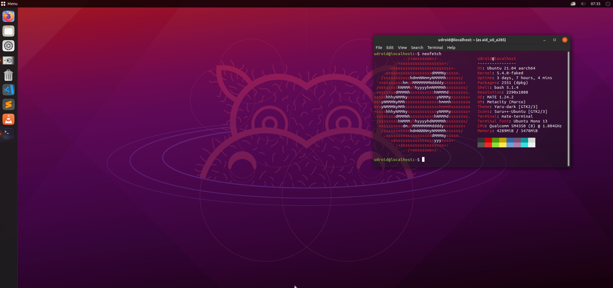
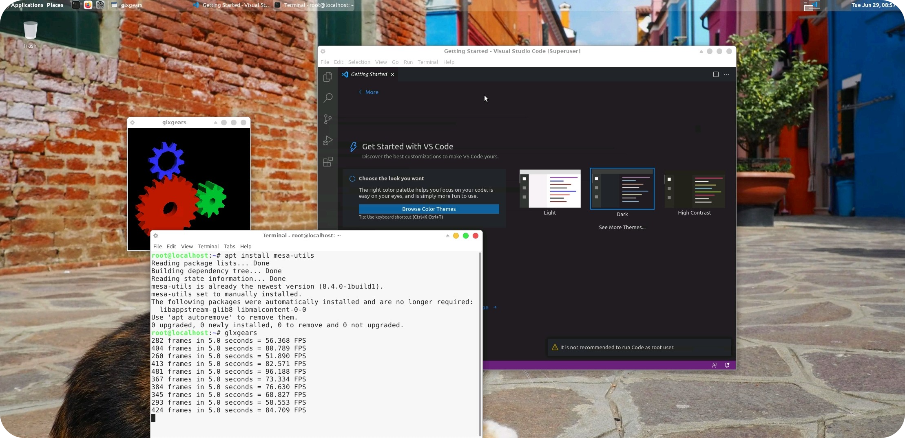
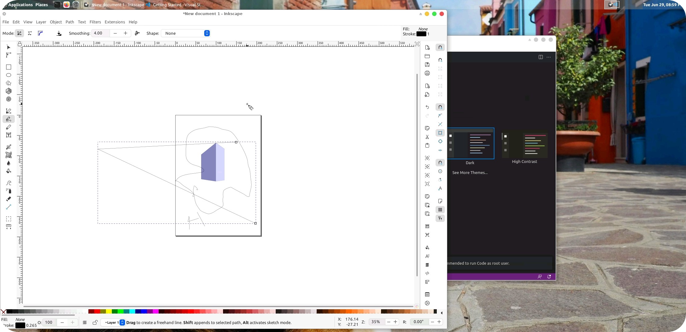

<p align="Center">

</p>
<p align="Center">


</p>

<p align="Center">

</p>

<p href="https://visitorbadge.io/status?path=https%3A%2F%2Fgithub.com%2FRandomCoderOrg%2Fubuntu-on-android" align=center><p>


<!--  -->

<h2 align="Center">Ubuntu-21.04 on android</h2>
Ubuntu-on-android aims to run ubuntu with pre-installed Desktop Environment, development tools, and software on top of android without root with the help of proot in termux application. This project just like any other linux on android projects but with aim of making it easy for end user on setting up linux.

[](https://discord.gg/h7wZ9BfbU9)


codename = `udroid`


## Supported arch status
| arch  | status |
|------ |--------|
| arm64 |  |
| armv7l |  |
| armv8l |  |
| amd64 | [](https://github.com/RandomCoderOrg/ubuntu-on-android/releases/tag/v3) |
| Others | `not started` |

## Desclaimer
Just before starting the installation, you can check [this.](md/desclaimer.md)

## Installation

```bash
# download installer
curl -L -o install.sh https://bit.ly/udroid-installer
# run the installer
bash install.sh
# Install ubuntu with this command
udroid -i xfce4
udroid -l xfce4
```

for more see [here.](md/installation.md)

## Some Screenshots




More can be found [here.](md/showcase.md)

> for building custom linux tarballs go [here](https://github.com/RandomCoderOrg/fs-cook)

## Runs-On


> these people are fuel for this project

## Licence
MIT
Copyright (c) 2021 Saicharan Kandukuri

###### feel free to contribute to this repo🤍.
