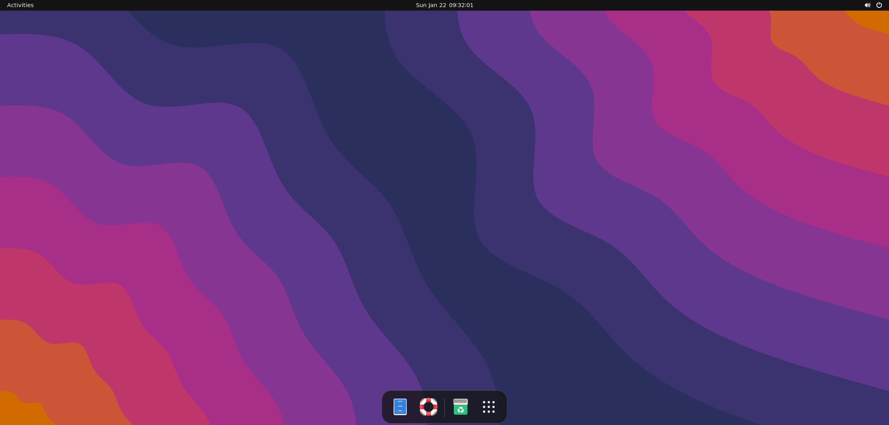

<div align="center">

</div>
<p align="Center">

</p>
<p align="Center">


</p>

<p align="Center">

</p>

<div align="center">


</div>

<p href="https://visitorbadge.io/status?path=https%3A%2F%2Fgithub.com%2FRandomCoderOrg%2Fubuntu-on-android" align=center><p>

<!--  -->

<h2 align="Center">Ubuntu on android</h2>

ubuntu-on-android is yet another utility allowing you to install pre-configured ubuntu with gui, development tools, and software on top of android without root via PRoot and Termux. Check the [disclaimer](md/desclaimer.md) before starting. 


[](https://discord.gg/h7wZ9BfbU9)


codename = `udroid`

## Installation


Before you install, please read the [wiki](https://udroid-rc.gitbook.io/) and [disclaimer](md/desclaimer.md). To install stable release of `udroid` filesystem run

```bash
. <(curl -Ls https://bit.ly/udroid-installer)
```

**for fresh termux installation**

```bash
apt update && apt upgrade -y
. <(curl -Ls https://bit.ly/udroid-installer)
```

**To install just the `udroid` tool**

```bash
apt update && apt upgrade -y
apt install git -y
git clone https://github.com/RandomCoderOrg/fs-manager-udroid
cd fs-manager-udroid
bash install.sh
udroid install jammy:xfce4
```

For advanced usage, check [this.](https://github.com/RandomCoderOrg/fs-manager-udroid/blob/main/README.md)


## Status
> ### Current Release

| Distribution  | XFCE4 | MATE | GNOME | RAW |
|:-------------- |:------:|:------:|:-:|:-----:|
| [Ubuntu Jammy (22.04) LTS](https://udroid-rc.gitbook.io/udroid-wiki/suites/ubuntu-22.04) | ✔ | ✔ | ✔ | ✔ |

> ### Early Release

| Distribution  | XFCE4 | MATE | GNOME | RAW |
|:-------------- |:------:|:------:|:-:|:-----:|
| [Ubuntu Lunar (23.04)](https://udroid-rc.gitbook.io/udroid-wiki/suites/ubuntu-23.04) | - | - | - | ✔ |
| [Ubuntu Kinetic (22.10)](https://udroid-rc.gitbook.io/udroid-wiki/suites/ubuntu-22.10) | - | - | - | ✔ |

> ### End of Life distros

| Distribution  | XFCE4 | MATE | RAW |
|-------------- |------|------|-----|
| [Ubuntu hirsute (21.04)](https://udroid-rc.gitbook.io/udroid-wiki/suites/ubuntu-21.04) |   ✔  |   X   |   ✔  |
| [Ubuntu focal (20.04)](https://udroid-rc.gitbook.io/udroid-wiki/suites/ubuntu-20.04) |    ✔ |    X   |   ✔ |
| [Ubuntu Impish (21.10)](https://udroid-rc.gitbook.io/udroid-wiki/suites/ubuntu-21.10) |   ✔  |   ✔  |    ✔ |


## Showcase

**->** `jammy:gnome`

**->** `jammy:xfce4`

**->** `jammy:mate`


Check [more.](md/showcase.md)

## Contribution
> ### Contributors/Stargazers/Watchers


> ### Contributing

Contributions are always welcome! We appreciate any type of contribution, not only code. For example, you can help the wiki shape up. Any changes to this repository/code should be submitted as a pull request, with well explained description.


## Misc 
For building custom linux tarballs, check [fs-cook.](https://github.com/RandomCoderOrg/fs-cook)

## Licence

MIT
Copyright © 2023 RandomCoderOrg

udroid logo "chad the penguin" designed by [Сэмми](https://github.com/b1tchysam)


