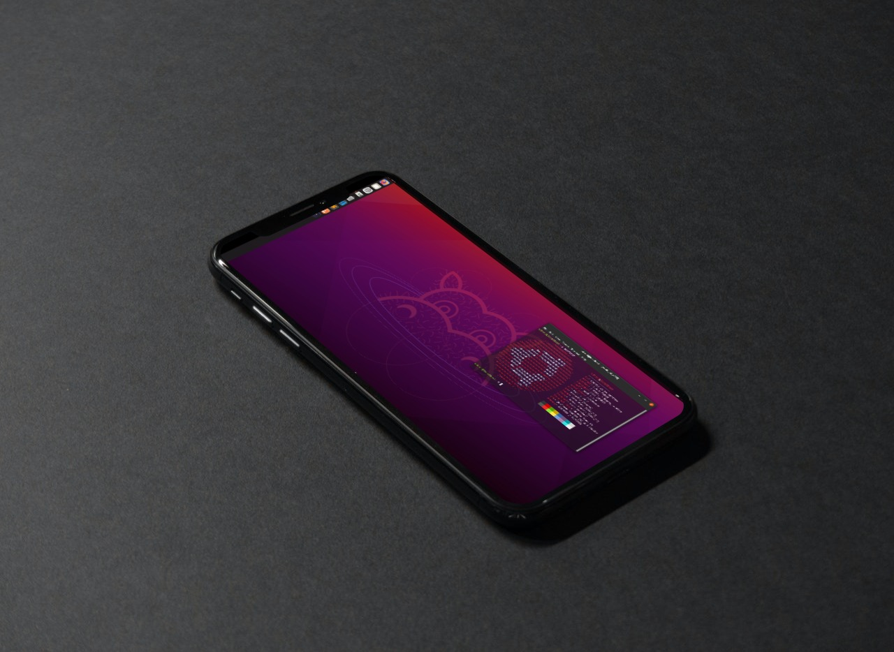

<h2 align="Center">Ubuntu-21.04 on android</h2>
Ubuntu-on-android aims to run ubuntu with pre-installed Desktop Environment, development tools, and software on top of android without root with the help of proot in termux application. This project just like any other linux on android projects but with aim of making it easy for end user on setting up linux.

 
 

codename = `udroid`

## Supported arch status
| arch  | status |
|------ |--------|
| arm64 |  |
| armv7l |  |
| armv8l |  |
| Others | `not started` |

## Desclaimer
Just before starting the installation, you can check [this.](https://github.com/RandomCoderOrg/ubuntu-on-android/blob/beta/desclaimer.md)

## Installation
Installation, variables, sound and other things can be found [here.](https://github.com/RandomCoderOrg/ubuntu-on-android/blob/beta/installation.md)

## Some Screenshot

More can be found [here.](https://github.com/RandomCoderOrg/ubuntu-on-android/blob/beta/showcase.md)

A small help from me if you want to build your own rootfs [wiki_page](https://github.com/RandomCoderOrg/ubuntu-on-android/wiki/commands-took-to-make-a-custom-rootfs)

## Devolopers & credits

DEV #0 = [Saicharankandukuri](https://github.com/SaicharanKandukuri)

Dev #1 = [Gxmersam](https://github.com/GxmerSam)

## Licence
MIT
Copyright (c) 2021 Saicharan Kandukuri

<h3 align="center"> More Updates coming soon...</h3>

feel free to contribute to this repo.
