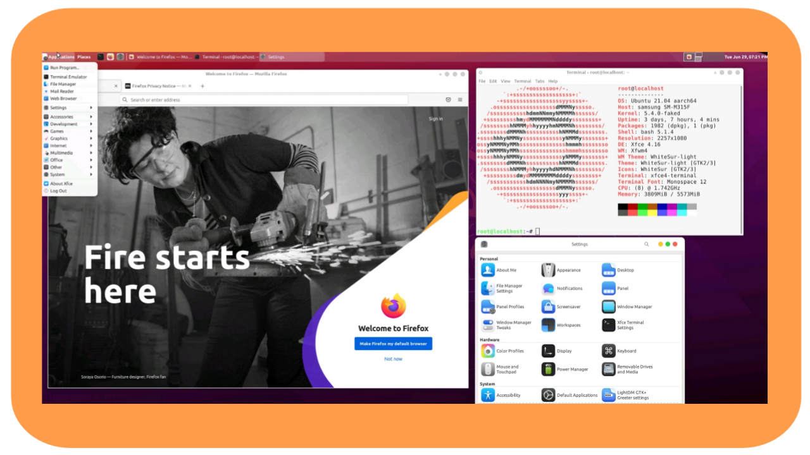
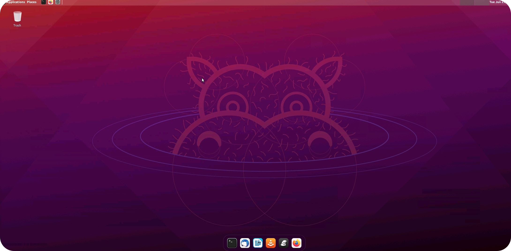

<h1 align="Center">Ubuntu 21.04 On android</h1>
A tweaked ubuntu-21.04 with xfce4 runs on android with termux/proot-distro

> This means now you can install ubuntu like above screenshot right in your smartphone without destroying your phone with rooting

| | |
|--|--|
|This project is | ![img](https://img.shields.io/badge/-Made%20with%20Bash-1f425f.svg?logo=image%2Fpng%3Bbase64%2CiVBORw0KGgoAAAANSUhEUgAAABgAAAAYCAYAAADgdz34AAAAGXRFWHRTb2Z0d2FyZQBBZG9iZSBJbWFnZVJlYWR5ccllPAAAAyZpVFh0WE1MOmNvbS5hZG9iZS54bXAAAAAAADw%2FeHBhY2tldCBiZWdpbj0i77u%2FIiBpZD0iVzVNME1wQ2VoaUh6cmVTek5UY3prYzlkIj8%2BIDx4OnhtcG1ldGEgeG1sbnM6eD0iYWRvYmU6bnM6bWV0YS8iIHg6eG1wdGs9IkFkb2JlIFhNUCBDb3JlIDUuNi1jMTExIDc5LjE1ODMyNSwgMjAxNS8wOS8xMC0wMToxMDoyMCAgICAgICAgIj4gPHJkZjpSREYgeG1sbnM6cmRmPSJodHRwOi8vd3d3LnczLm9yZy8xOTk5LzAyLzIyLXJkZi1zeW50YXgtbnMjIj4gPHJkZjpEZXNjcmlwdGlvbiByZGY6YWJvdXQ9IiIgeG1sbnM6eG1wPSJodHRwOi8vbnMuYWRvYmUuY29tL3hhcC8xLjAvIiB4bWxuczp4bXBNTT0iaHR0cDovL25zLmFkb2JlLmNvbS94YXAvMS4wL21tLyIgeG1sbnM6c3RSZWY9Imh0dHA6Ly9ucy5hZG9iZS5jb20veGFwLzEuMC9zVHlwZS9SZXNvdXJjZVJlZiMiIHhtcDpDcmVhdG9yVG9vbD0iQWRvYmUgUGhvdG9zaG9wIENDIDIwMTUgKFdpbmRvd3MpIiB4bXBNTTpJbnN0YW5jZUlEPSJ4bXAuaWlkOkE3MDg2QTAyQUZCMzExRTVBMkQxRDMzMkJDMUQ4RDk3IiB4bXBNTTpEb2N1bWVudElEPSJ4bXAuZGlkOkE3MDg2QTAzQUZCMzExRTVBMkQxRDMzMkJDMUQ4RDk3Ij4gPHhtcE1NOkRlcml2ZWRGcm9tIHN0UmVmOmluc3RhbmNlSUQ9InhtcC5paWQ6QTcwODZBMDBBRkIzMTFFNUEyRDFEMzMyQkMxRDhEOTciIHN0UmVmOmRvY3VtZW50SUQ9InhtcC5kaWQ6QTcwODZBMDFBRkIzMTFFNUEyRDFEMzMyQkMxRDhEOTciLz4gPC9yZGY6RGVzY3JpcHRpb24%2BIDwvcmRmOlJERj4gPC94OnhtcG1ldGE%2BIDw%2FeHBhY2tldCBlbmQ9InIiPz6lm45hAAADkklEQVR42qyVa0yTVxzGn7d9Wy03MS2ii8s%2BeokYNQSVhCzOjXZOFNF4jx%2BMRmPUMEUEqVG36jo2thizLSQSMd4N8ZoQ8RKjJtooaCpK6ZoCtRXKpRempbTv5ey83bhkAUphz8fznvP8znn%2B%2F3NeEEJgNBoRRSmz0ub%2FfuxEacBg%2FDmYtiCjgo5NG2mBXq%2BH5I1ogMRk9Zbd%2BQU2e1ML6VPLOyf5tvBQ8yT1lG10imxsABm7SLs898GTpyYynEzP60hO3trHDKvMigUwdeaceacqzp7nOI4n0SSIIjl36ao4Z356OV07fSQAk6xJ3XGg%2BLCr1d1OYlVHp4eUHPnerU79ZA%2F1kuv1JQMAg%2BE4O2P23EumF3VkvHprsZKMzKwbRUXFEyTvSIEmTVbrysp%2BWr8wfQHGK6WChVa3bKUmdWou%2BjpArdGkzZ41c1zG%2Fu5uGH4swzd561F%2BuhIT4%2BLnSuPsv9%2BJKIpjNr9dXYOyk7%2FBZrcjIT4eCnoKgedJP4BEqhG77E3NKP31FO7cfQA5K0dSYuLgz2TwCWJSOBzG6crzKK%2BohNfni%2Bx6OMUMMNe%2Fgf7ocbw0v0acKg6J8Ql0q%2BT%2FAXR5PNi5dz9c71upuQqCKFAD%2BYhrZLEAmpodaHO3Qy6TI3NhBpbrshGtOWKOSMYwYGQM8nJzoFJNxP2HjyIQho4PewK6hBktoDcUwtIln4PjOWzflQ%2Be5yl0yCCYgYikTclGlxadio%2BBQCSiW1UXoVGrKYwH4RgMrjU1HAB4vR6LzWYfFUCKxfS8Ftk5qxHoCUQAUkRJaSEokkV6Y%2F%2BJUOC4hn6A39NVXVBYeNP8piH6HeA4fPbpdBQV5KOx0QaL1YppX3Jgk0TwH2Vg6S3u%2BdB91%2B%2FpuNYPYFl5uP5V7ZqvsrX7jxqMXR6ff3gCQSTzFI0a1TX3wIs8ul%2Bq4HuWAAiM39vhOuR1O1fQ2gT%2F26Z8Z5vrl2OHi9OXZn995nLV9aFfS6UC9JeJPfuK0NBohWpCHMSAAsFe74WWP%2BvT25wtP9Bpob6uGqqyDnOtaeumjRu%2ByFu36VntK%2FPA5umTJeUtPWZSU9BCgud661odVp3DZtkc7AnYR33RRC708PrVi1larW7XwZIjLnd7R6SgSqWSNjU1B3F72pz5TZbXmX5vV81Yb7Lg7XT%2FUXriu8XLVqw6c6XqWnBKiiYU%2BMt3wWF7u7i91XlSEITwSAZ%2FCzAAHsJVbwXYFFEAAAAASUVORK5CYII%3D) |
|status|  |
|Maintainence status |  |
|Platform | **Android Termux App (proot `ptrace()` )**|
| Linux Distribution |  |
|Community | [](https://discord.gg/h7wZ9BfbU9) [](https://gitter.im/ubuntu-on-android/community?utm_source=badge&utm_medium=badge&utm_campaign=pr-badge&utm_content=badge) |
| Code quality & stats | [](https://www.codefactor.io/repository/github/randomcoderorg/ubuntu-on-android) |
- codename -> `udroid`

<details>
  <summary>Note & Disclaimer (Must read !)</summary>

A note before you try
- As lot of it is preinstalled you can login and start right after you install 
- As this runs on termux and on software rendering so performence clearly depends on CPU, ram and storage read-write speed!
- Don't try heavy apps unless you have a good device :)
- If you have any issues or suggestions make sure i know at https://github.com/RandomCoderOrg/ubuntu-on-android/issue (create an issue)

> **Disclaimer** : 
- i dont work with any company or organization of ubuntu or any third party sources took in making fs(for now).
- This project works by compliying to selinux android. and all aim of the project is just run linux on android without direct root with a twist and this project improves time by time with your support and motivation.
- the linux you trying to install from this repo is not fully functional in target space because of the selinux policies, and increasing requirement in linux requirements and also because project is set to run with `ptrace()` a low level access in android kernel
- Graphics performence is really bad cause proot and usage on VNC, we dont support any adoptation on improving it **for now** cause insufficient data on android (ping me in discord if you have any ideas or any codes on this) 
- - **(Update)** see https://github.com/RandomCoderOrg/ubuntu-on-android/wiki/XWayland-in-proot to run smooth and fast session
- This project comes without warranties or data protection
</details>

## supported architectures status
| arch  | status |
|------ |--------|
| arm64 |  |
| armv7l |  |
| armv8l |  |
| amd64 |  |
| Others | `not started` |

## Desclaimer
Just before starting the installation, you can check [this.](md/desclaimer.md)

## Installation

```bash
# download installer
curl -L -o install.sh https://bit.ly/udroid-installer
# run the installer
bash install.sh
# Install udroid xfce4 with this command
udroid -i xfce4
# Login to xfce4
udroid -l xfce4
```

for more see [here.](md/installation.md)

## Some Screenshots




[](https://app.fossa.com/projects/git%2Bgithub.com%2FRandomCoderOrg%2Fubuntu-on-android?ref=badge_shield)

> for building custom linux tarballs go [here](https://github.com/RandomCoderOrg/fs-cook)

## Devolopers

<a href="https://github.com/RandomCoderOrg/ubuntu-on-android/graphs/contributors">
  
</a>

> DEV #0 = [Saicharankandukuri](https://github.com/SaicharanKandukuri)
>
> Dev #1 = [Gxmersam](https://github.com/GxmerSam)

## Licence
MIT
Copyright (c) 2021 Saicharan Kandukuri

###### feel free to contribute to this repo🤍.
